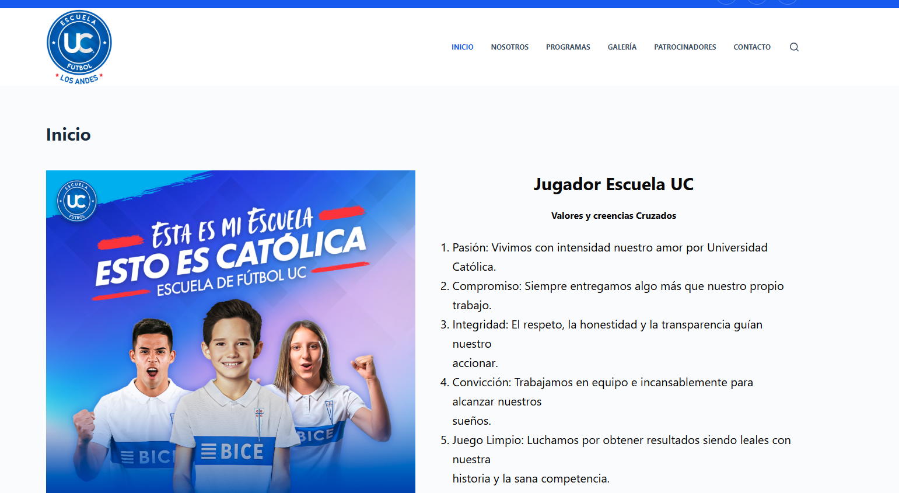

<h1 align="center">Hi, I'm LUIS SALINAS </h1>

  

	
## <picture></picture> About me

<picture> </picture>

  

- :school: I am a cybersecurity engineering student at the "Universidad de las Americas, Chile.
- :student: I’m currently learning `Ethical Hacker` and `Programming `.
- :nerd_face: Always `learning new things`.
 
<h3 align="center" > Connect with me 🤝 </h3>

  

    
    
    
  

<iframe src="https://tryhackme.com/api/v2/badges/public-profile?userPublicId=3185425" style='border:none;'></iframe>

## 🛠️ My Skills

### <picture>   </picture> Programming languages

 
  &emsp; 
 

  

  

	   
 ### <picture>   </picture> IDEs

  &emsp;
  
  &emsp;
  
  &emsp;

 ### <picture>   </picture> Operating Systems
 

  &emsp;
    
  &emsp;
  
  &emsp;
    
  &emsp;

  <h2>Algunos proyectos 👨🏻‍💻</h2> https://escuelafutboluclosandes.cl/

  <table align="left">
    <tr>
      <td width="25%" align="center">
        
      </td>
    </tr>
  </table>

<!-- Connect with me -->
<!--h2 without bottom border-->

  <ul align="center">
    
<h2 style="display: inline-block">Connect With Me🤝</h2>

  </ul>

<!--icons and links-->

     
     
Loading

